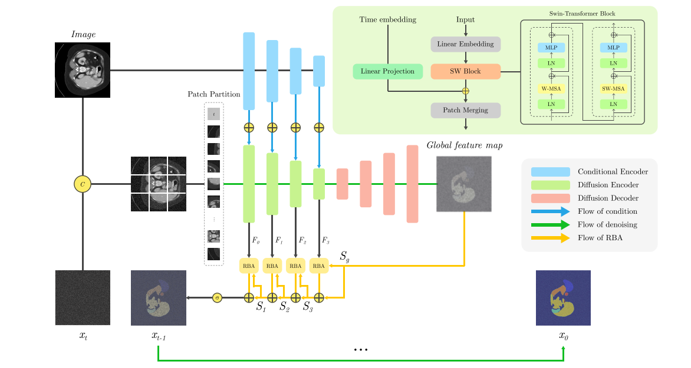

## DTS 💥
The code implement of "Advancing Medical Image Segmentation: Morphology-Driven Learning with Diffusion Transformer"

## Updates 📌
[2024/7/19]🔥 DTS has been accepted to [BMVC2024](https://bmvc2024.org/) !

## What is DTS 👀
DTS employs a diffusion transformer segmentation architecture and morphology-driven learning methods to significantly improve medical image segmentation accuracy, effectively capturing small organs and addressing the essential challenges of medical imaging.



## Features
Please get the datasets from the below.
BTCV [here](https://www.synapse.org/#!Synapse:syn3193805/wiki/217789)

## Requirements

```
pip install -r requirements.txt
```

# Training & Testing

Both training and evaluation scripts use a YAML configuration file to specify all necessary parameters.

---

## 🛠️ Usage

### Training

```bash
python train.py --config path/to/train_config.yaml
```

### Training

```bash
python test.py --config path/to/test_config.yaml
```

## ⚙️ Required Argument

- `--config`: Path to the YAML file containing all parameters.

## 📌 Notes
- For training, make sure to correctly set values like data_path, save_dir, and any logging-related fields in your YAML.
- For testing, ensure that model_path points to a valid checkpoint file, and data_path correctly specifies the dataset location.